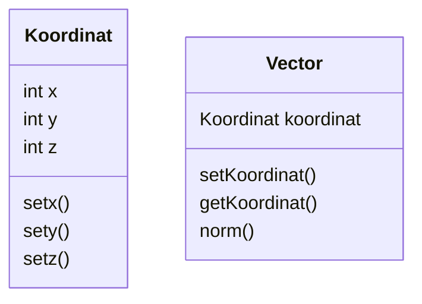

# Exercise 9 Struktur Data

## Introduction Section
1. Jelaskan definisi object dalam Paradigma Object-Oriented!
2. Jelaskan tiga tujuan dalam Paradigma Object-Oriented!
3. Jelaskan tiga prinsip dalam Paradigma Object-Oriented!
4. Sebutkan contoh design pattern dalam Paradigma Object-Oriented!

## Class and Object
1. Jelaskan definisi Class!
2. Jelaskan perbedaan Attribute dengan Method!
3. Jelaskan apa itu instansiasi Object!
4. Jelaskan apa itu identifier!

## Implementing Class
Implementasikan kelas diagram "Kendaraan" berikut ke dalam Python!

   Class Kendaraan :
   
    - string nomorPlat
    - string merk
    - string jenis
    - string warna
    - int tanggalBeli
    - int bulanBeli
    - int tahunBeli
    - double berat
    - double harga
    - showTanggalPembelian()

## Main OOP Concept
1. Jelaskan konsep encapsulation dalam Paradigma Object-Oriented!
2. Jelaskan konsep inheritance dalam Paradigma Object-Oriented!
3. Jelaskan perbedaan public method dan private method dalam encapsulation!
4. Jelaskan perbedaan superclass dan subclass dalam inheritance!


## Programming Exercise
- Buatlah class diagram dari code python berikut ini:

```python
class Koordinat:
	def __init__(self,x,y):
		self.z = 0
		self.x = x
		self.y = y
	def set_x(self,x):
		self.x = x
	def increment_x(self):
		self.x+=1
	def __str__(self):
		return f"x : {self.x} , y:{self.y} , z:{self.z}"
```

- Implementasikan class diagram berikut menjadi program python!



- fungsi norm() adalah fungsi untuk menghitung norm dari sebuah vector yaitu
norm = $\sqrt{x^2 + y^2 + z^2}$ . Buatlah fungsi untuk menghitung norm dari vector berdasarkan class yang telah anda buat! 
```python
class vector(Koordinat):
  def setKoordinat(self,Koordinat):
    self.Koordinat = Koordinat

  def getKoordinat(self):
    return self.Koordinat

  def norm(self):
    print(self.x**2 + self.y**2+self.z**2)

nilai = vector(1,2,3)
nilai.norm()
```

- Euclidian Distance adalah jarak antara 2 vector dan didefinisikan sebagai 
$$d = \sqrt{ (x_1 - x_2)^2 + (y_1 - y_2)^2 + (x_1 - x_2)^2 } $$
buatlah program untuk menghitung euclidian distance antara 2 vector berdasarkan class yang telah anda buat!
```python
import math
class Koordinat:
  def __init__(self,x,y,z):
    self.z = z
    self.x = x
    self.y = y

  def set_x(self):
    return self.x

  def set_y(self):
    return self.y 

  def set_z(self):
    return self.z 
a = Koordinat(1,2,3)
b = Koordinat(4,5,6)

x1 = a.set_x()
y1 = a.set_y()
z1 = a.set_z()

x2 = b.set_x()
y2 = b.set_y()
z2 = b.set_z()

koor1 = (x1,y1,z1)
koor2 = (x2,y2,z2)

def panjang(x,y):
  sum = 0
  for i in range(len(x)):
    sum = sum +(x[i]-y[i])**2
    return sum**0.5
print(int(panjang(koor1,koor2)))
```

- Perhatikan tabel berikut

| Vector | x   | y   | z   | kelas |
| ------ | --- | --- | --- | ----- |
| A      | 0   | 1   | 1   | 0     |
| B      | 2   | 2   | 2   | 1     |
| C      | 1.5 | 1.2 | 1.5 | 1     |
| D      | 10  | 9   | 8   | 0     |
| E      | 5   | 5   | 5   | 0     |
| F      | 8   | 8   | 8   | 0     |
| G      | 6   | 6   | 1   | 0     |
| H      | 3   | 3   | 3   | ?     |

Salah satu metode dalam data science untuk melakukan klasifikasi adalah dengan menggunakan k-nearest neighbor, dimana cara menentukan label kelas adalah dengan cara melihat tetangga dengan euclidian distance terdekat. Tentukan kelas dari vector H dengan cara:
- Tentukan 3 tetangga paling dekat dari H 
- dari 3 tetangga tersebut, pilih kelas yang paling banyak muncul
- Jadikan kelas yang paling banyak muncul tersebut sebagai kelas dari vector H

Implementasikan algoritma tersebut menggunakan program python dengan paradigma object-oriented programming yang telah anda pelajari!
